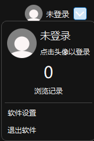
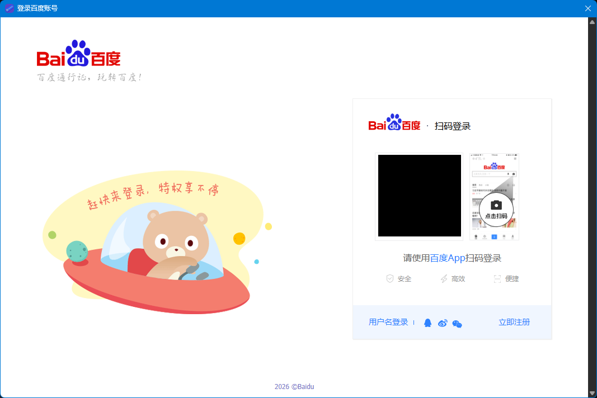
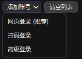

# 贴吧桌面

 

一个非官方的百度贴吧电脑客户端, 使用 PyQt5 开发

> [!note]
>
> 由于学业原因，更新会较为缓慢，一些 Bug 可能无法及时修复，还请谅解。  
> 如对本项目有任何建议或问题，欢迎提交 Issues。

## 如何使用

在本仓库的 `Releases` 找到最新的版本，可以下载到最新版的 `.zip` 压缩包和 `.exe` 安装程序。

### 登录

进入软件后，点击右上角的箭头按钮，再点击头像或 `未登录` 字样即可启动登录流程。  
此时可以使用任意百度系软件扫码登录。  

在 WebView2 可用的系统下，软件会弹出百度账号的登录页面；

否则会弹出原生的扫码登录界面。

当然，本软件也支持多种登录方式，任君选择。

> [!note]
> 
> 如果你有对本项目进行二次开发的需求，请参阅：
> * [如何配置贴吧桌面的开发环境](https://github.com/clb-128258/TiebaDesktop/blob/main/docs/how-to-set-up-env.md)  
> * [主程序构建指南](https://github.com/clb-128258/TiebaDesktop/blob/main/docs/build-guide.md)

## 功能实现

- 账号管理
    - [x] 内置浏览器登录
    - [x] 扫码登录
    - [x] bduss + stoken 直接登录
    - [x] 多账号切换
    - [ ] 无痕登录模式
- 看贴
    - [x] 首页推荐看贴
    - [x] 吧内看贴
    - [x] 贴子详情页、楼层查看
    - [x] 楼中楼查看
    - [x] 查看富媒体（图片、视频、语音等）
    - [x] 保存贴内视频
    - [x] 跳页功能
- 社区功能
    - 吧
        - [x] 查看自己关注的吧
        - [x] 查看吧详情信息
        - [x] 吧内关注、签到
        - [x] 一键签到、成长等级签到
        - [x] [命令行参数签到](https://github.com/clb-128258/TiebaDesktop/blob/main/docs/command-usages.md)
        - [x] 首页进吧页签到
    - 用户
        - [x] 个人主页
        - [x] 查看用户的 主题贴 / 回复贴 / 关注的吧 / 关注列表 / 粉丝列表
        - [x] 关注 / 拉黑 / 禁言用户
    - 互动
        - [x] 点赞
        - [ ] 点踩
        - [x] 收藏
        - [x] 查看 点赞 / 回复 / @ 我的人
        - [x] 互动消息推送
    - 发贴（不建议使用，可能导致封号）
        - [ ] 发主题
        - [x] 发回复
        - [ ] 回复楼层 / 楼中楼
- 足迹
    - [x] 收藏列表
    - [x] 点赞历史列表
    - [x] 内容浏览记录
- 实用功能
    - [x] 内置浏览器
    - [x] 全吧搜索
    - [x] 吧内搜索
    - [x] 右键文字搜索 / 链接跳转
    - [x] 剪切板链接跳转
    - [x] 无网络通知提示
    - [ ] 下载贴子数据
- 个性化
    - [x] 首页屏蔽视频贴
    - [x] 隐藏用户 IP 属地
    - [x] 设置贴内默认楼层顺序
    - [x] 设置吧内默认贴子排序
- 视觉体验
    - [x] 深色 / 浅色主题
    - [x] 跟随系统设置自动切换主题
- 等等...

## 致谢

另外要特别感谢以下开源仓库：  
[lumina37/aiotieba - 贴吧 API 的 Python 实现](https://github.com/lumina37/aiotieba)，没有这个仓库就没有本软件的诞生。  
[n0099/tbclient.protobuf - 贴吧 .proto 定义合集](https://github.com/n0099/tbclient.protobuf)，该仓库为本项目的 protobuf
开发提供了很大的便利.

## 友情链接

[TiebaLite - 一个第三方安卓贴吧客户端](https://github.com/HuanCheng65/TiebaLite)  
[NeoTieBa - 一个基于 Tauri2.0 + Vue3 + TypeScript 构建的非官方贴吧客户端](https://github.com/Vkango/NeoTieBa)

## 许可声明

本软件遵循 MIT License 发布，请在遵守 MIT License 的前提下使用本软件。  
本软件仅供学习交流使用，请勿用于任何商业或非法用途，使用本软件所产生的任何后果都与作者无关。
