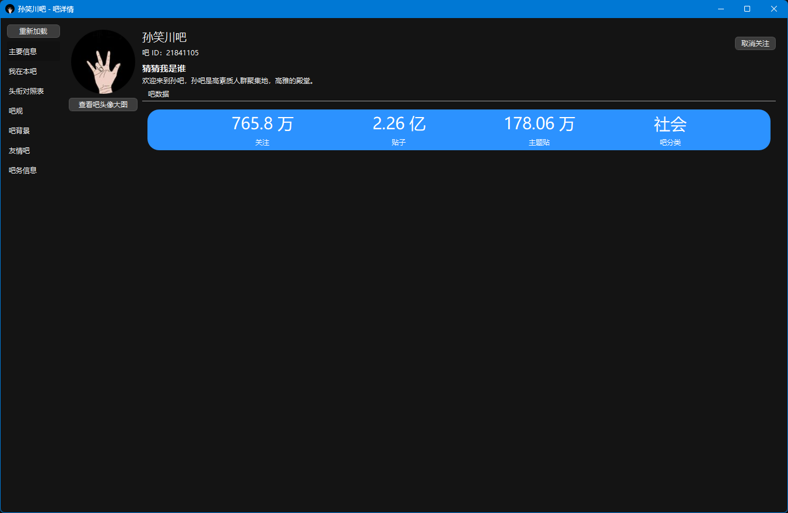
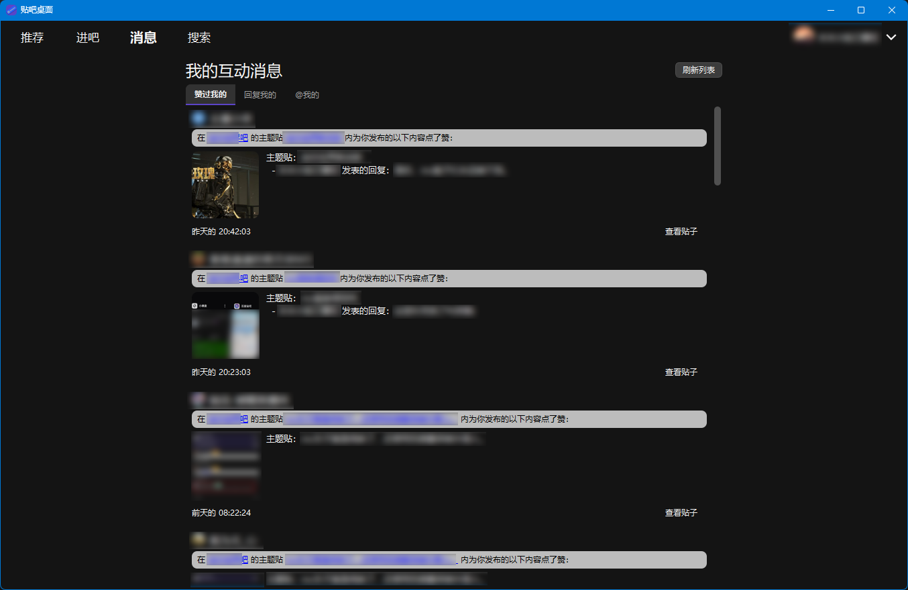

<p align="center">

</p>

<div align="center">

# 贴吧桌面

**现代化的第三方百度贴吧 Windows 桌面客户端**


*使用 PyQt5 精心打造，为桌面用户量身定制的贴吧体验*

</div>

---

## ✨ 核心特性

| 特性             | 说明                       |
|----------------|--------------------------|
| 🎨 **现代化界面**   | 专为电脑设备优化，深浅主题自动切换        |
| 🔐 **灵活登录**    | 内置浏览器、扫码、Token 直接登录等多种方式 |
| 👥 **多账号管理**   | 轻松切换多个账号，各账号数据独立保存       |
| ⚡ **双倍签到经验**   | 基于官方小组件原理实现的经验翻倍机制       |
| 🛠️ **命令行支持**  | 支持启动参数调用，自动化工作流程         |
| 🎯 **丰富个性化设置** | 屏蔽首页视频、隐藏 IP 属地、自定义排序等   |
| 🔒 **本地隐私保护**  | 所有数据仅在本地处理，绝不上传          |

## 📦 每日自动构建版本

### 🌙 什么是每夜版？

本项目启用了 GitHub Actions 自动构建流程，每天都会生成最新的测试版本，让你随时体验最新功能！

- ⏰ **自动构建时间**：每天凌晨 2:00（北京时间）
- ⚠️ **构建延迟**：由于 GitHub Actions 虚拟机资源分配延迟，实际执行会晚 几分钟 ~ 2小时 不等

### 📥 如何获取最新版本？

1. 打开本项目的 [**Actions**](https://github.com/clb-128258/TiebaDesktop/actions) 页面
2. 选择最新的一条 workflow
3. 在 **Artifacts** 部分下载构建产物

> [!important]
>
> - ✅ 当前仅支持 **64 位 Windows 系统**（其他系统敬请期待）
> - ⏳ 构建产物保留期为 **2 天**，超期自动删除

## 🖼️ 界面预览

<div style="display: grid; grid-template-columns: repeat(2, 1fr); gap:8px;">




</div>

## 🚀 功能特性

### 👤 账号管理

- ✅ 内置浏览器登录
- ✅ 扫码登录
- ✅ 百度 Token 登录
- ✅ 多账号切换
- ⏳ 无痕登录模式

### 📖 看贴浏览

- ✅ 首页推荐看贴
- ✅ 吧内看贴
- ✅ 贴子详情页、楼层查看
- ✅ 楼中楼查看
- ✅ 查看富媒体（图片、视频、语音等）
- ✅ 保存贴内视频
- ✅ 跳页功能

### ✍️ 互动功能

- ✅ 发回复
- ✅ 点赞
- ✅ 收藏
- ✅ 查看 点赞 / 回复 / @我 的人
- ✅ 互动消息推送
- ⏳ 点踩
- ⏳ 发主题

> 💡 **关于发贴功能**：不建议使用，可能导致 `封号` `发贴秒删` 等后果

### 🏘️ 吧内功能

- ✅ 查看自己关注的吧
- ✅ 查看吧详情信息
- ✅ 吧内关注、签到
- ✅ 一键签到、成长等级签到
-
✅ [命令行启动参数签到](https://github.com/clb-128258/TiebaDesktop/blob/main/docs/command-usages.md#%E7%AD%BE%E5%88%B0%E6%89%80%E6%9C%89%E5%85%B3%E6%B3%A8%E7%9A%84%E5%90%A7)
- ✅ 首页进吧页直接签到
- ✅ **⚡ 翻倍的签到经验值**

### 👥 用户功能

- ✅ 个人主页
- ✅ 关注 / 拉黑 / 禁言用户

### 📚 足迹管理

- ✅ 收藏列表
- ✅ 点赞历史列表
- ✅ 内容浏览记录

### 🛠️ 实用工具

- ✅ 内置浏览器
- ✅ 全吧搜索
- ✅ 吧内搜索
- ✅ 右键文字搜索 / 链接跳转 / 电子邮箱识别
- ✅ 剪切板链接跳转
- ✅ 无网络通知提示
- ✅ 贴内图片百度识图
- ⏳ 下载贴子数据

### 🎨 个性化设置

- ✅ 首页屏蔽视频贴
- ✅ 隐藏用户 IP 属地
- ✅ 设置贴内默认楼层顺序
- ✅ 设置吧内默认贴子排序

### 🌙 视觉体验

- ✅ 深色 / 浅色主题
- ✅ 跟随系统设置自动切换主题

---

## ⚡ 特色功能说明

### 翻倍签到经验值 🎁

> [!warning]
>
> `翻倍的签到经验值` 功能是基于 `官方小组件签到入口` 实现的。
>
> 即通过手机端的桌面小组件进入贴吧再签到可获得双倍经验值。本软件通过这一原理实现了双倍签到经验。
>
> 由于该特性可能涉及 `功能滥用`，因此**默认情况下是关闭的**，可以在软件设置中手动打开。

## 📂 项目结构

```text
TiebaDesktop/
├─ aiotieba-fix-files/     # aiotieba 库的修补文件
├─ build-tools/            # 构建和打包工具集
├─ docs/                   # 文档和资源
│  ├─ app-ui-grabs/       # 应用界面截图
│  ├─ build-guide.md      # 构建指南
│  ├─ command-usages.md   # 命令行用法文档
│  └─ how-to-set-up-env.md # 开发环境配置指南
│
└─ src/                    # 💻 核心源代码
   ├─ binres/             # 二进制依赖（FFmpeg、WebView2 等）
   ├─ proto/              # Protocol Buffer 相关文件（与贴吧 API 通信）
   ├─ publics/            # 公用组件和工具库
   ├─ resf/               # 原始 UI 设计文件和 .proto 定义
   ├─ subwindow/          # 核心业务代码（主窗口、子窗口类）
   ├─ ui/                 # UI 资源和样式
   │  └─ js_player/      # 前端视频播放器（基于西瓜播放器）
   ├─ consts.py           # 常量定义
   ├─ main.py             # 📍 主程序入口点
   └─ requirements.txt    # Python 依赖列表
```

## 🔨 开发指南

要进行二次开发或本地构建，请参阅以下文档：

- 📖 [如何配置开发环境](https://github.com/clb-128258/TiebaDesktop/blob/main/docs/how-to-set-up-env.md)
- 🏗️ [主程序构建指南](https://github.com/clb-128258/TiebaDesktop/blob/main/docs/build-guide.md)
- 💻 [命令行启动参数](https://github.com/clb-128258/TiebaDesktop/blob/main/docs/command-usages.md)

## 🙏 致谢

感谢以下开源项目的支持和启发：

| 项目                                                                 | 说明                               |
|--------------------------------------------------------------------|----------------------------------|
| [🎯 aiotieba](https://github.com/lumina37/aiotieba)                | 贴吧 API 的 Python 实现，本项目的核心基础      |
| [📋 tbclient.protobuf](https://github.com/n0099/tbclient.protobuf) | 贴吧 .proto 定义合集，提供了 protobuf 开发基础 |
| [🎬 xgplayer](https://h5player.bytedance.com/)                     | 西瓜播放器，本项目视频播放器的基础                |

## 🔗 友情链接

- 📱 [TiebaLite](https://github.com/HuanCheng65/TiebaLite) - 第三方安卓贴吧客户端（已停更）
- 📱 [TiebaLite (维护版)](https://github.com/zzc10086/TiebaLite) - 由 [zzc10086](https://github.com/zzc10086) 维护的
  TiebaLite
- 🌐 [NeoTieBa](https://github.com/Vkango/NeoTieBa) - 基于 Tauri2.0 + Vue3 + TypeScript 构建的非官方贴吧客户端
- 🛠️ [eazy-tieba](https://github.com/Dilettante258/eazy-tieba) - 强大且开源的百度贴吧工具箱

## ⚖️ 免责声明

> [!warning]
>
> 1. 🔒 **隐私保护**：本软件只会在本地处理你的个人信息与账号数据，你的数据永远不会被分享或上传到其他任何地方；
> 2. 📜 **开源协议**：本软件遵循 MIT License 发布，请在遵守 MIT License 的前提下使用本软件；
> 3. ⚠️ **免责声明**：本软件仅供学习交流使用，请勿用于任何商业或非法用途。使用本软件所产生的任何后果都与作者无关。

