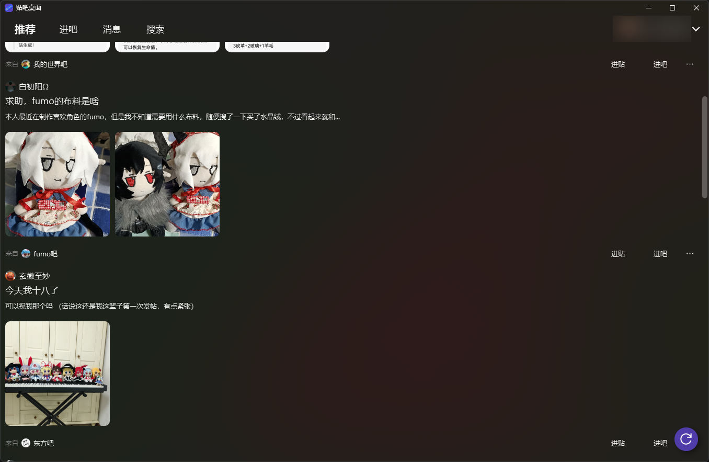
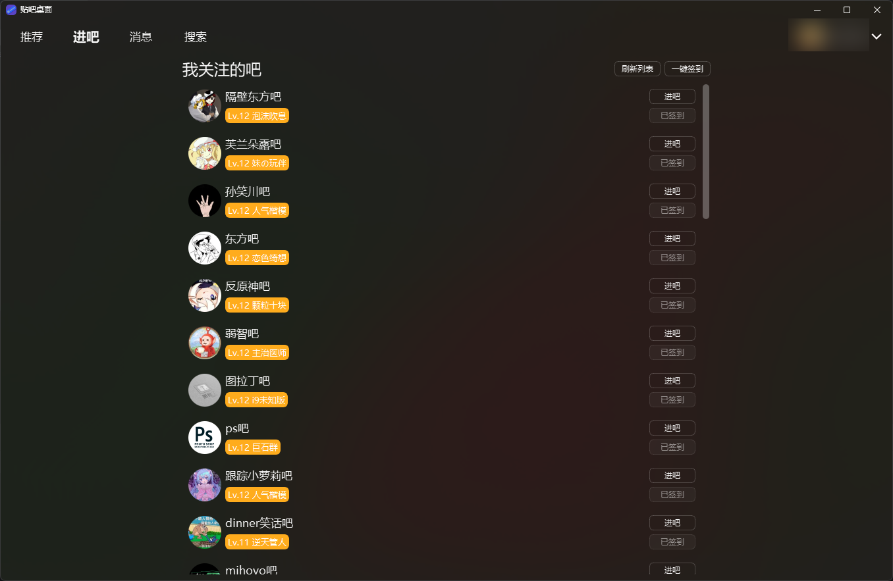
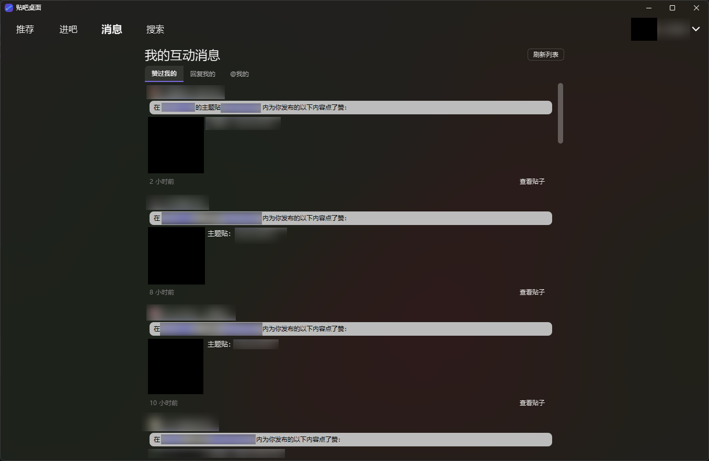
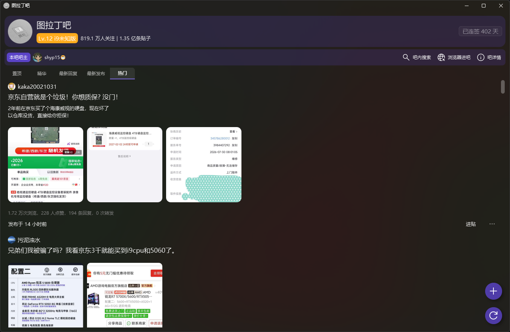
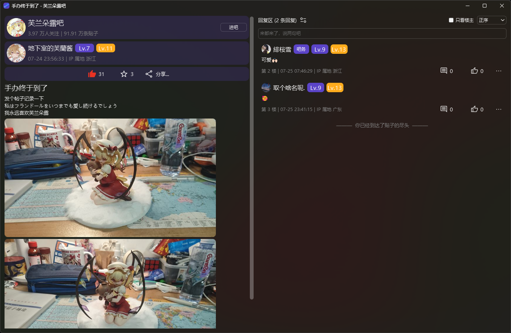
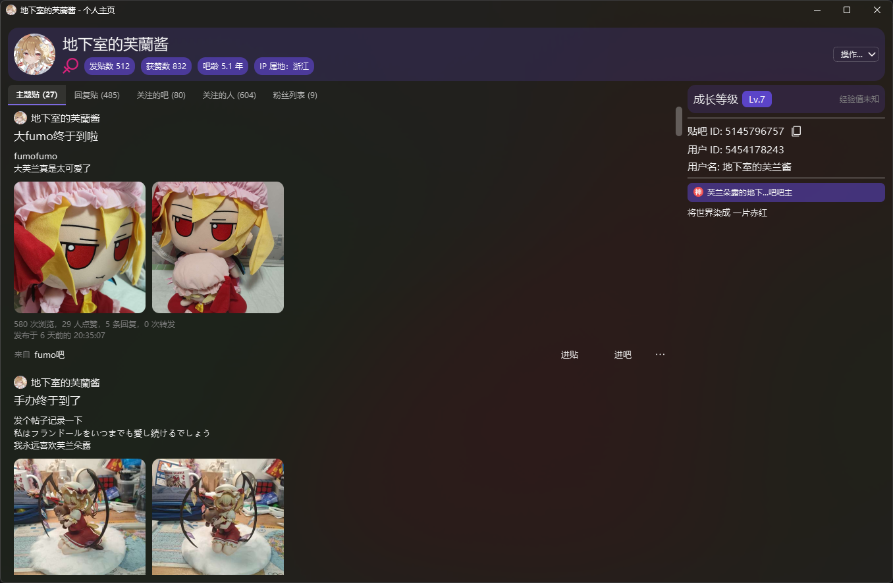

<p align="center">

</p>

<div align="center">

# 贴吧桌面


**适用于桌面端的第三方贴吧客户端**

</div>

---

## ✨ 核心特性

| 特性 | 说明 |
|------|------|
| 🎨 现代化界面 | 适配电脑操作，支持 Mica/Acrylic/Aero 材质、自定义图片背景、窗口透明度 |
| 🧐 个人主页 | 查看回贴、贴吧工具箱快捷入口、显示隐藏主题贴等 |
| 🔐 灵活登录 | 支持内置浏览器、扫码、Token 登录 |
| 👥 多账号管理 | 多账号自由切换，数据各自独立保存 |
| ⚡ 双倍签到经验 | 基于官方小组件原理实现经验翻倍 |
| 🛠️ 命令行支持 | 通过启动参数执行任务，便于自动化 |
| 🎯 丰富设置 | 屏蔽首页视频、隐藏 IP 属地、自定义排序等 |
| 🔒 本地隐私保护 | 数据仅在本地处理，账号信息加密存储 |

## 🖼️ 界面概览

<div align="center">










</div>

## 📦 兼容性与自动构建

支持 Windows 与主流 Linux 发行版，仅提供 x86_64 版本（暂不支持 macOS 及其它架构）。

- **Windows**：Windows 7 及以上，需安装 Visual C++ Redistributable 2015-20xx、.NET Framework 4.8 与 Edge WebView2。
- **Linux**：提供 deb/rpm 包，兼容 Debian/Ubuntu/Fedora 等发行版。

> Linux 版已在 `Ubuntu 24.04 x64` 系统下进行过测试，  
> Windows 版在 `Windows 7/8.1 x64` `Windows 10 1709/22H2 x64` `Windows 11 24H2 x64` 环境下均已测试过。

### 📥 自动构建

GitHub Actions 每天构建最新测试版。打开 [Actions](https://github.com/clb-128258/TiebaDesktop/actions) 页面，选择最新 workflow，在 **Artifacts** 中下载产物：

- Windows：`TiebaDesktop-<版本>-win64.zip` 与 NSIS 安装程序
- Linux：`TiebaDesktop-<版本>-linux64.zip`、`.deb`、`.rpm`

> [!important]
> 构建产物保留 **2 天**，超期自动删除。

## 🚀 功能特性

<details>
<summary>👤 账号管理</summary>

- ✅ 内置浏览器登录
- ✅ 扫码登录
- ✅ 百度 Token 登录
- ✅ 多账号切换
- ✅ 导出账号信息

</details>

<details>
<summary>📖 看贴浏览</summary>

- ✅ 首页推荐看贴
- ✅ 吧内看贴
- ✅ 贴子详情页、楼层查看
- ✅ 楼中楼查看
- ✅ 查看富媒体（图片、视频、语音等）
- ✅ 保存贴内视频
- ✅ 跳页功能

</details>

<details>
<summary>✍️ 互动功能</summary>

- ✅ 发回复
- ✅ 点赞
- ✅ 收藏
- ✅ 查看 点赞 / 回复 / @我 的人
- ✅ 互动消息推送
- ✅ 发主题
- ⏳ 点踩

> 💡 发主题可能导致 `封号`、`发贴秒删秒屏蔽`，不建议使用。

</details>

<details>
<summary>🏘️ 吧内功能</summary>

- ✅ 查看自己关注的吧
- ✅ 查看吧详情信息
- ✅ 吧内关注、签到
- ✅ 一键签到、成长等级签到
- ✅ [命令行启动参数签到](https://github.com/clb-128258/TiebaDesktop/blob/main/docs/command-usages.md#%E7%AD%BE%E5%88%B0%E6%89%80%E6%9C%89%E5%85%B3%E6%B3%A8%E7%9A%84%E5%90%A7)
- ✅ 首页进吧页直接签到
- ✅ ⚡ 签到经验翻倍

</details>

<details>
<summary>👥 用户功能</summary>

- ✅ 个人主页
  - ✅ 展示总发贴数、获赞数等信息
  - ✅ 右侧展示用户名、百度用户 ID 等基础信息
  - ✅ 直接查看用户的回贴列表
  - ✅ 显示用户最完整的主题贴列表（包括被隐藏、屏蔽、删除的所有历史发贴）
  - ✅ 用户隐藏关注吧列表时，显示你与该用户共同关注的吧
- ✅ 关注 / 拉黑用户

> 💡 若用户开启 `隐藏个人动态`，则无法查看其回贴列表，主题贴列表也仅显示公开贴子。

</details>

<details>
<summary>📚 足迹管理</summary>

- ✅ 收藏列表
- ✅ 点赞历史列表
- ✅ 内容浏览记录

</details>

<details>
<summary>🛠️ 实用工具</summary>

- ✅ 内置浏览器
- ✅ 全吧搜索
- ✅ 吧内搜索
- ✅ 右键文字搜索 / 链接跳转 / 电子邮箱识别
- ✅ 剪切板链接跳转通知
- ✅ 无网络通知
- ✅ 贴内图片百度识图
- ⏳ 下载贴子数据

</details>

<details>
<summary>🎨 个性化设置</summary>

- ✅ 首页屏蔽视频贴
- ✅ 隐藏用户 IP 属地
- ✅ 设置贴内默认楼层顺序
- ✅ 设置吧内默认贴子排序

</details>

<details>
<summary>🌙 视觉体验</summary>

- ✅ 深色 / 浅色主题
- ✅ 跟随系统设置自动切换主题
- ✅ UI 动画效果
- ✅ 窗口透明度
- ✅ 自定义图片背景（支持图片不透明度）
- ✅ 特殊背景效果
  - ✅ Win7 Aero 背景
  - ✅ Win11 Mica 材质背景
  - ✅ Win10/11 Acrylic 材质背景

</details>

---

## 🔨 开发指南

二次开发或本地构建请参阅 [开发环境配置](https://github.com/clb-128258/TiebaDesktop/blob/main/docs/how-to-set-up-env.md)、[主程序构建指南](https://github.com/clb-128258/TiebaDesktop/blob/main/docs/build-guide.md)、[命令行启动参数](https://github.com/clb-128258/TiebaDesktop/blob/main/docs/command-usages.md)。

## 📂 项目结构

```text
TiebaDesktop/
├─ aiotieba-fix-files/     # aiotieba 库的修补文件
├─ build-tools/            # 构建和打包工具集
├─ docs/                   # 文档和资源
│  ├─ app-ui-grabs/       # 应用界面截图
│  ├─ build-guide.md      # 构建指南
│  ├─ command-usages.md   # 命令行用法文档
│  └─ how-to-set-up-env.md # 开发环境配置指南
│
└─ src/                    # 💻 核心源代码
   ├─ binres/             # 二进制依赖（FFmpeg、WebView2 等）
   ├─ proto/              # Protocol Buffer 相关文件（与贴吧 API 通信）
   ├─ publics/            # 公用组件和工具库
   ├─ resf/               # 原始 UI 设计文件和 .proto 定义
   ├─ subwindow/          # 核心业务代码（子窗口类）
   ├─ ui/                 # UI 资源和样式
   │  └─ js_player/      # 前端视频播放器（基于西瓜播放器）
   ├─ consts.py           # 常量定义
   ├─ main.py             # 📍 主程序入口点
   └─ requirements.txt    # Python 依赖列表
```

## 🙏 致谢

感谢以下开源项目：

| 项目 | 说明 |
|------|------|
| [🎯 aiotieba](https://github.com/lumina37/aiotieba) | 贴吧 API 的 Python 实现，本项目的核心基础 |
| [📋 tbclient.protobuf](https://github.com/n0099/tbclient.protobuf) | 贴吧 .proto 定义合集 |
| [🎬 xgplayer](https://h5player.bytedance.com/) | 西瓜播放器，本项目视频播放器的基础 |
| [📢 toaster (Win8)](https://github.com/nels-o/toaster) | Win8/8.1 通知功能的实现基础 |

## 🔗 友情链接

- 📱 [TiebaLite](https://github.com/HuanCheng65/TiebaLite) — 第三方安卓贴吧客户端（已停更）
- 📱 [TiebaLite（维护版）](https://github.com/zzc10086/TiebaLite) — 由 [zzc10086](https://github.com/zzc10086) 维护
- 🌐 [NeoTieBa](https://github.com/Vkango/NeoTieBa) — 基于 Tauri 2.0 + Vue3 + TypeScript 的第三方贴吧客户端
- 🛠️ [eazy-tieba](https://github.com/Dilettante258/eazy-tieba) — 开源的百度贴吧工具箱

## ⚖️ 免责声明

1. **隐私**：个人信息与账号数据仅在本地处理，不会上传或分享。
2. **协议**：本项目基于 MIT License 发布，请在遵守该协议的前提下使用。
3. **免责**：仅供学习交流，请勿用于商业或非法用途，使用本软件产生的后果与作者无关。
